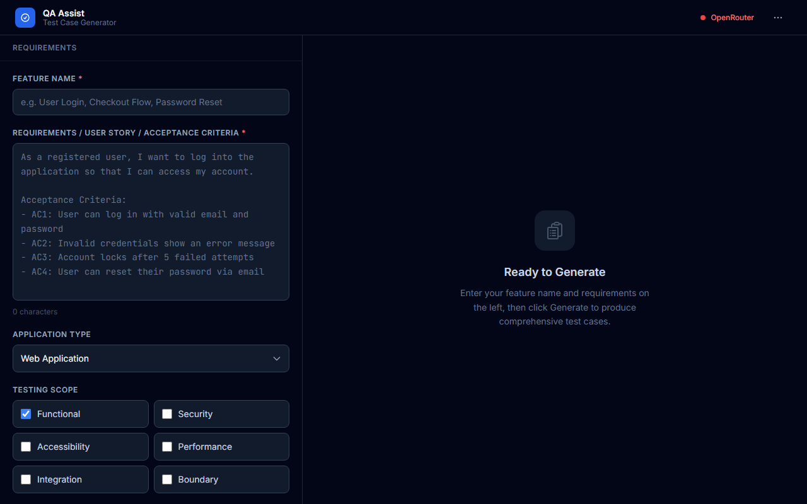
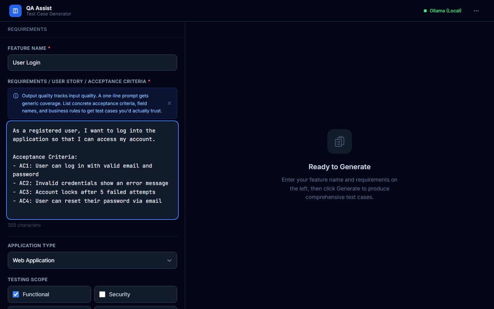
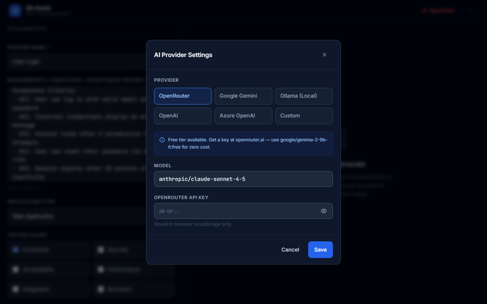
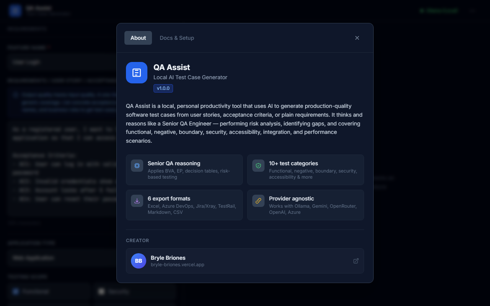
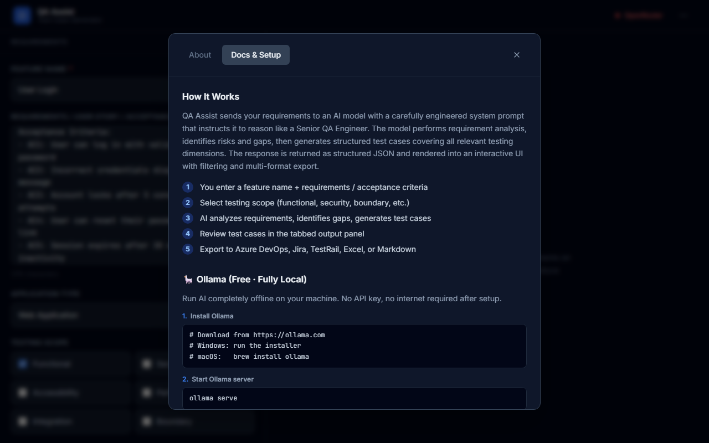

<div align="center">


# QA Assist

**AI-powered Test Case Generator**

Generate production-quality test cases from user stories and acceptance criteria — the way a Senior QA Engineer would.

[](https://react.dev)
[](https://www.typescriptlang.org)
[](https://vite.dev)
[](https://tailwindcss.com)
[](LICENSE)
[](https://github.com/Buraizuuu/qa-testcase-generator/pulls)

Built by [**Bryle Briones**](https://bryle-briones.vercel.app/)

</div>

---

## Screenshots

<div align="center">

### Main Interface


### Input Panel with Requirements


### AI Provider Settings


### About


### Docs & Setup Guide


</div>

---

## What it does

QA Assist takes your feature requirements and generates comprehensive test cases — not just happy paths, but negative scenarios, boundary values, risk areas, missing requirement gaps, and a full coverage matrix.

**Output includes:**
- Requirement summary & extracted business rules
- Identified gaps (missing requirements to clarify with PO/BA)
- Risk assessment (High / Medium / Low per area)
- High-level test scenarios
- Detailed test cases with steps, test data, preconditions, and expected results
- Acceptance criteria → test case traceability matrix
- Regression impact analysis
- Automation recommendations with justification

**Testing techniques applied automatically:**
Boundary Value Analysis · Equivalence Partitioning · Decision Table Testing · State Transition · Error Guessing · Risk-Based Testing · Positive & Negative Testing

---

## Quick start

### Prerequisites

- [Node.js 18+](https://nodejs.org)
- An AI provider — see [Provider Setup](#provider-setup) below (free options available)

### Install & run

```bash
git clone https://github.com/Buraizuuu/qa-testcase-generator.git
cd qa-testcase-generator
npm install
npm run dev
```

Open [http://localhost:5173](http://localhost:5173) in your browser.

**First launch:** click the **⋯ menu → Settings** and configure your AI provider. No Anthropic account required — works with Ollama (free, local), Google Gemini (free tier), OpenRouter, OpenAI, or Azure OpenAI.

---

## Provider Setup

QA Assist works with any OpenAI-compatible API. Choose the option that suits you:

### Ollama — Free, fully local (best for privacy)

No API key. Runs entirely on your machine.

```bash
# 1. Install Ollama — https://ollama.com
# 2. Start the server
ollama serve

# 3. Pull a model (pick one)
ollama pull llama3.2          # recommended — good reasoning, 4.7 GB
ollama pull llama3.1:8b       # best quality — requires ~8 GB RAM
ollama pull qwen2.5-coder:3b  # smallest — 1.9 GB, less reliable output
```

**Settings:** Provider = `Ollama` · Model = `llama3.2` · No API key needed

> **Tip:** `llama3.2` is the minimum recommended model for reliable structured JSON output. `qwen2.5-coder:3b` may produce parse errors on complex requirements.

---

### Google Gemini — Free tier (1,500 req/day)

```
1. Go to https://aistudio.google.com → Get API key
2. Settings: Provider = Google Gemini · Model = gemini-2.0-flash · Paste key
```

---

### OpenRouter — Access Claude, GPT-4, Gemini from one API

```
1. Sign up at https://openrouter.ai → Dashboard → Keys → Create Key
2. Settings: Provider = OpenRouter · Model = anthropic/claude-sonnet-4-5
```

Free models (no credits): `google/gemma-2-9b-it:free` · `mistralai/mistral-7b-instruct:free`

---

### Azure OpenAI

```
Settings:
  Provider  = Azure OpenAI
  Base URL  = https://{resource}.openai.azure.com/openai/deployments/{deployment}
  Model     = your deployment name (e.g. gpt-4o)
  API Key   = your Azure key
```

---

## Understanding the output

After generation, the right panel shows four tabs:

| Tab | What it shows |
|-----|---------------|
| **Overview** | Requirement summary, business rules, identified gaps, risk assessment |
| **Scenarios** | High-level test scenarios — good for early review with developers |
| **Test Cases** | Full table with search, filters, and expandable step-by-step detail |
| **Coverage** | Acceptance criteria traceability matrix + automation recommendations |

The **Automate?** column in the Test Cases tab indicates whether the AI recommends the test case as an automation candidate — use the filter dropdown to isolate them.

---

## Export formats

| Format | Use case |
|--------|----------|
| **Excel (.xlsx)** | Full export with 5 sheets — test cases, overview, risk, coverage, automation |
| **Azure DevOps CSV** | Import into Azure Test Plans |
| **Jira / Xray CSV** | Import via Xray CSV importer |
| **TestRail CSV** | Import via TestRail CSV importer |
| **Markdown** | Documentation, wikis, PR descriptions |
| **Generic CSV** | Custom import mappings, spreadsheet analysis |

---

## Testing scope

Select which categories to include before generating:

| Scope | What it covers |
|-------|----------------|
| **Functional** | Happy paths, business rules, user flows |
| **Negative** | Invalid inputs, error handling, permission failures |
| **Boundary** | Min/max values, null/empty, special characters |
| **Integration** | API interactions, database, external services |
| **Security** | Auth, authorization, injection, session handling |
| **Accessibility** | WCAG, keyboard navigation, screen readers, ARIA |
| **Performance** | Load, concurrency, timeouts, large datasets |

---

## Common issues

**"Failed to parse response as JSON"**
The model returned text outside the JSON. Use a larger model — `llama3.2` minimum for Ollama, or `gemini-2.0-flash` for free cloud.

**"Model not found in Ollama"**
Run `ollama list` to see installed models, then `ollama pull <model-name>`.

**Ollama shows Offline**
Start the server: `ollama serve`. On Windows, check the system tray — Ollama may already be running.

**Response cuts off mid-generation**
The model hit its token limit. Reduce the testing scope or switch to a model with a larger context window.

---

## Tech stack

- **Frontend:** React 18 + TypeScript + Vite 6
- **Styling:** Tailwind CSS v3
- **AI:** Provider-agnostic OpenAI-compatible fetch client (no SDK lock-in)
- **Exports:** SheetJS (Excel), native Blob (CSV, Markdown)
- **State:** React hooks + localStorage — no backend, no server

---

## Privacy

- API keys are stored in **browser localStorage only** — never sent anywhere except your configured AI provider
- No analytics, no telemetry, no data collection
- When using Ollama, all data stays on your local machine

---

## Contributing

Issues and PRs welcome. For major changes, open an issue first to discuss.

---

## License

MIT © [Bryle Briones](https://bryle-briones.vercel.app/)
